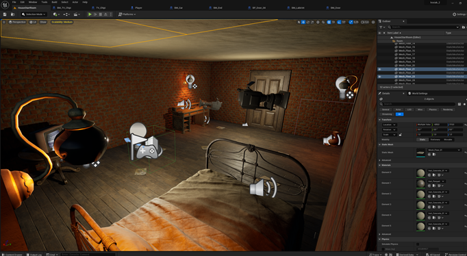
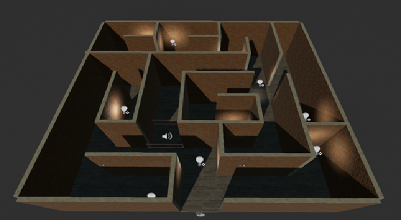
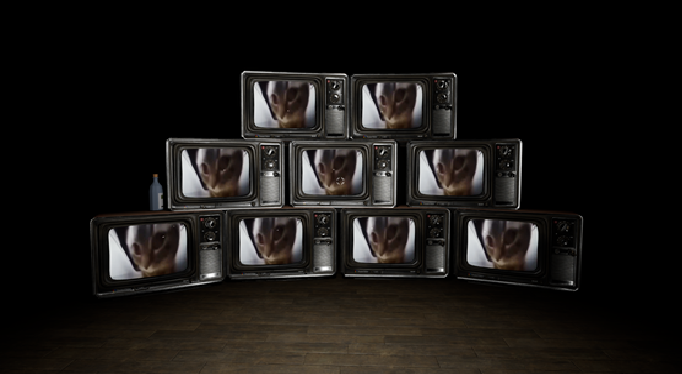
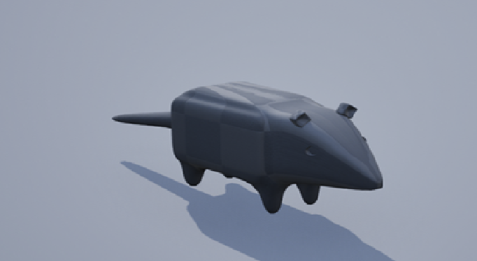

# Отчет о игре "Travel to BM"

## Краткое описание игры

**"Travel to BM"** - увлекательная хоррор-игра, где игрок погружается в мистический мир университетского здания, наполненного тайнами и опасностями. Главный герой, студент, оказывается запертым в этом мрачном месте, и чтобы выжить, ему необходимо решать головоломки, находить ключи и избегать монстров, скрывающихся в тени.

## Особенности геймплея

### Уникальные игровые механики

- **Интерактивные квесты:** Игроки сталкиваются с разнообразными квестами, требующими не только нахождения предметов, но и применения логики для решения сложных головоломок.

- **Динамические события:** Геймплей дополняется динамическими событиями, где решения игрока влияют на развитие сюжета, создавая ощущение реального влияния персональных решений на ход игры.

### Разнообразие локаций и кабинетов

- **Уникальные комнаты:** Каждая аудитория обладает своей уникальной атмосферой и головоломками, обеспечивая игрокам постоянное чувство новизны.

- **Скрытые проходы:** Игроки обнаруживают скрытые двери и проходы, добавляя элемент неожиданности и разнообразия в исследование здания.

### Угроза монстров

- **Разнообразие врагов:** Различные монстры преследуют игрока, реагируя на его действия, создавая постоянное чувство угрозы и требуя тактического мышления.

- **Изменчивость врагов:** Враждебные сущности обладают различными характеристиками, стратегиями атаки и слабостями, поддерживая динамичность геймплея.
  

## Графика и звуковое сопровождение

- **Освещение и тени:** Система освещения используется для создания атмосферы ужаса, подчеркивая напряженность каждого момента.

- **Звуковое сопровождение:** Тщательно продуманные звуки - шаги в коридорах, неясные шепоты и неопределенные звуки - создают уникальную атмосферу и дополнительное напряжение.

## Заключение

"Travel to BM" обещает увлекательное погружение в мир ужаса, сочетая уникальные игровые механики, разнообразные локации и захватывающую графику с потрясающим звуковым сопровождением. Эта игра обязательна для поклонников жанра хоррор и любителей захватывающих приключений.

